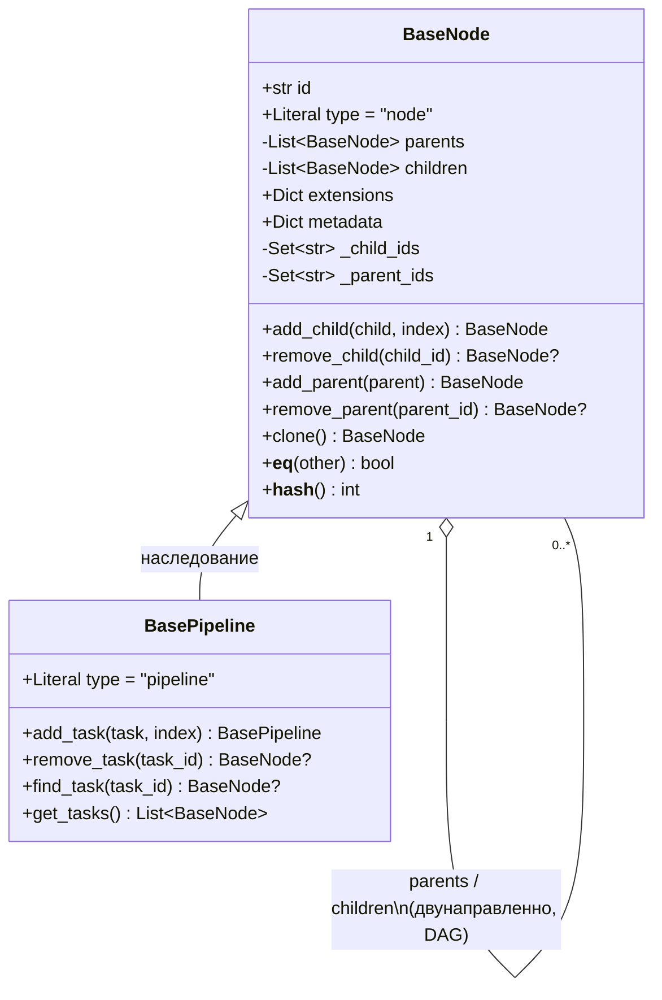
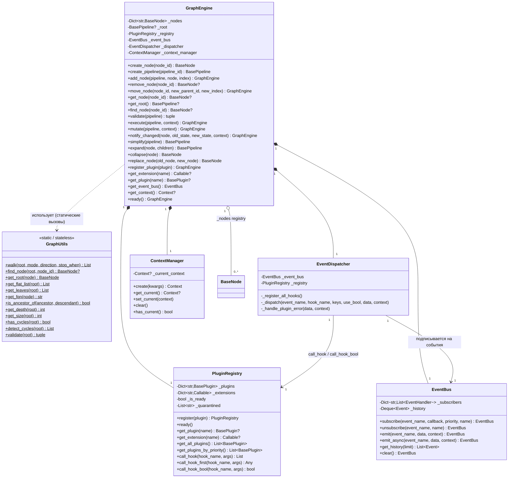
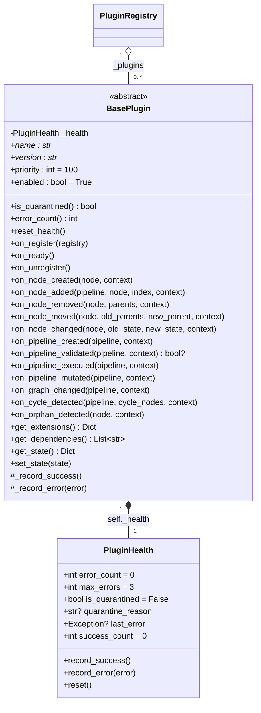
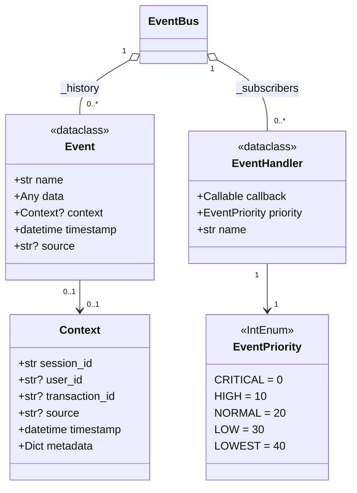

# Class Diagram (UML, Mermaid)

## Граф данных: `BaseNode` / `BasePipeline`

`parents`/`children` помечены как `-` (private по UML-нотации) не потому,
что реально скрыты Python-инкапсуляцией (это обычные публичные атрибуты
pydantic-модели), а потому что оба поля объявлены с `exclude=True` —
исключены из сериализации (`model_dump()`/JSON). Ассоциация `BaseNode
"1" o-- "0..*" BaseNode` двунаправленная и симметрично поддерживается
методами `add_child`/`add_parent` — единственный способ гарантированно не
рассинхронизировать обе стороны связи.

## Фасад и его зависимости

`*--` — композиция (жизненный цикл владеемого объекта совпадает с жизнью
`GraphEngine`: `PluginRegistry`/`EventBus`/`EventDispatcher`/
`ContextManager` создаются в `GraphEngine.__init__` и не разделяются между
разными `GraphEngine`). `o--` — агрегация: узлы в `_nodes` существуют и вне
контекста конкретного вызова (пользователь может держать ссылку на `node`
уже после того, как он удалён из `_nodes`).

## Плагины и здоровье

`name`/`version` помечены `*` — абстрактные `@property`, обязательные к
переопределению у наследников. На практике (см. примеры и тесты) они
переопределяются как простые атрибуты класса — Python это допускает.

## Событийная модель

