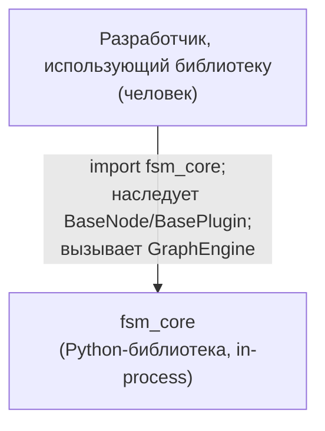
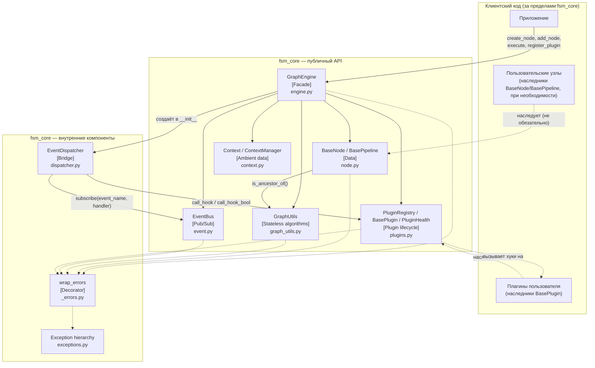

# Component Diagram (C4 — Level 2: Container/Component)

## Контекст (C4 Level 1)

`fsm_core` — не сервис, не отдельный процесс: это библиотека, встраиваемая
в процесс потребителя. C4 «Level 1: System Context» здесь вырожден до
одного actor'а и одной системы — внешних систем, с которыми `fsm_core`
взаимодействовал бы по сети/API, в коде нет (нет HTTP-клиентов, нет работы
с БД, нет очередей сообщений).

## Компоненты (C4 Level 3)

### Легенда

- **Сплошная стрелка** — прямой вызов метода / импорт.
- **Пунктирная стрелка** — отношение наследования или использование
  декоратора/иерархии исключений (не вызов конкретного метода в моменте).
- `[Facade]`, `[Data]`, `[Stateless algorithms]`, `[Pub/Sub]`, `[Plugin
  lifecycle]`, `[Ambient data]`, `[Bridge]`, `[Decorator]` — архитектурная
  роль компонента, не тип из UML.

### Кто снаружи, кто внутри

Публичный API (`fsm_core/__init__.py`) экспортирует: `GraphEngine`,
`BaseNode`/`BasePipeline`, `GraphUtils`, `EventBus`/`Event`/
`EventHandler`/`EventPriority`, `BasePlugin`/`PluginRegistry`/
`PluginHealth`, `Context`/`ContextManager`. `EventDispatcher`,
`wrap_errors` и внутренние классы `_Validate` каждого модуля — не
экспортируются и не задуманы для прямого использования потребителем
библиотеки (см. `docs/architecture.md`).
