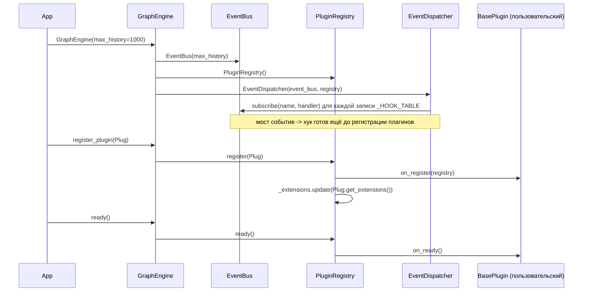
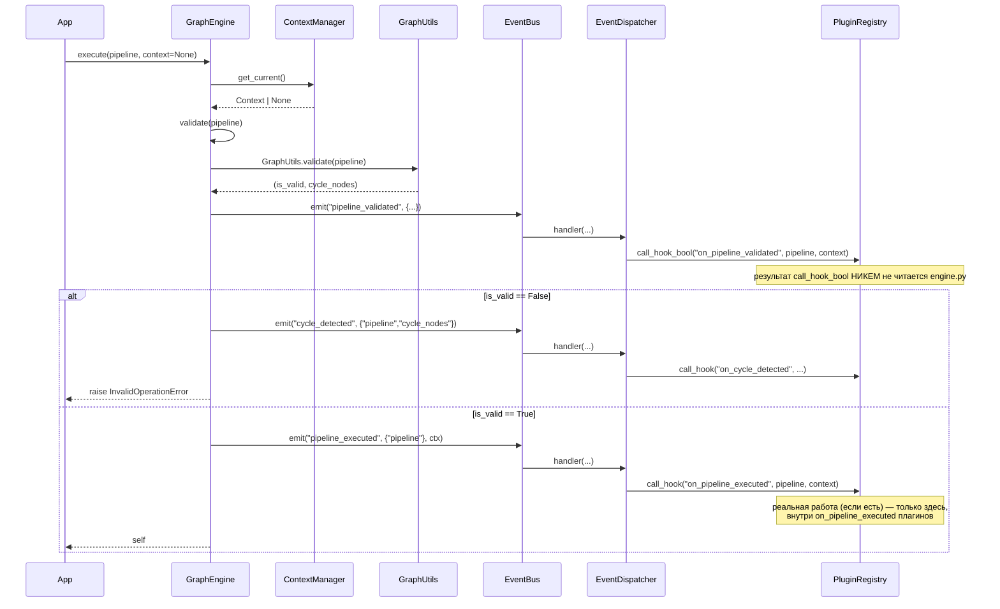
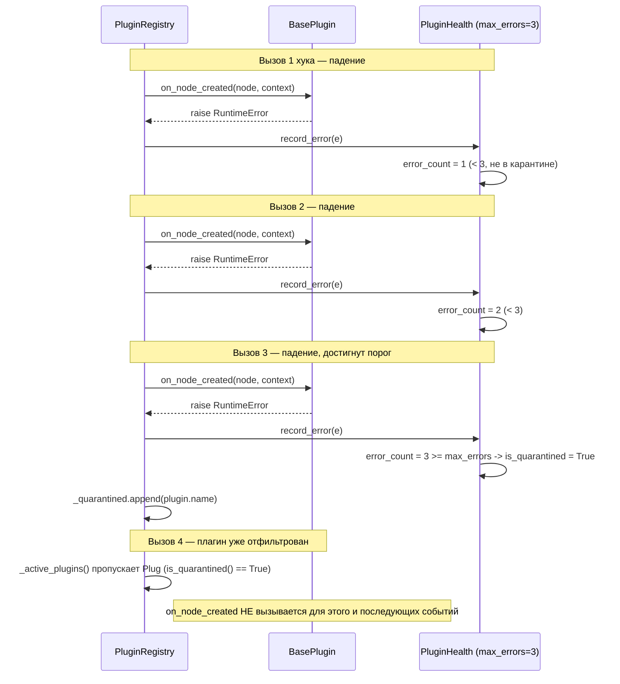

# Sequence Diagrams

## Инициализация `GraphEngine` и подключение плагина



## `add_node` — от вызова API до хука плагина

```mermaid
sequenceDiagram
    participant App
    participant Engine as GraphEngine
    participant Node as BasePipeline/BaseNode
    participant Utils as GraphUtils
    participant Bus as EventBus
    participant Disp as EventDispatcher
    participant Reg as PluginRegistry
    participant P1 as Plugin (priority=10)
    participant P2 as Plugin (priority=100, quarantined)

    App->>Engine: add_node(pipeline, node, index=None)
    Engine->>Node: pipeline.add_child(node, index)
    Node->>Utils: is_ancestor_of(node, pipeline)
    Utils-->>Node: False (нет цикла)
    Node->>Node: children.append(node); node.parents.append(pipeline)
    Node-->>Engine: OK
    Engine->>Engine: self._nodes[node.id] = node
    Engine->>Bus: emit("node_added", {"pipeline","node","index"})
    Bus->>Bus: history.append(event)
    Bus->>Disp: handler(data, context)  (единственный подписчик на "node_added")
    Disp->>Disp: разобрать data по ключам ("pipeline","node","index")
    Disp->>Reg: call_hook("on_node_added", pipeline, node, index, context)
    Reg->>Reg: get_plugins_by_priority() -> [P1(10), P2(100)]
    Reg->>P1: on_node_added(pipeline, node, index, context)
    P1-->>Reg: OK -> _record_success()
    Note over Reg,P2: P2 в карантине -> _active_plugins() его пропускает
    Reg-->>Disp: [результат P1]
    Disp-->>Bus: (return value отброшен)
    Bus-->>Engine: OK
    Engine-->>App: self
```

## `execute` — валидация, публикация, и то, что `execute` НЕ делает



## `emit_async` — конкурентное выполнение обработчиков

```mermaid
sequenceDiagram
    participant App
    participant Bus as EventBus
    participant H1 as async handler (priority=HIGH)
    participant H2 as sync handler (priority=LOW)
    participant Loop as asyncio event loop

    App->>Bus: await emit_async("job.done", data)
    Bus->>Bus: history.append(event)
    par запуск в порядке приоритета, выполнение — конкурентно
        Bus->>H1: await callback(data, context)
        Bus->>Loop: asyncio.to_thread(H2.callback, data, context)
        Loop->>H2: callback(data, context)  (в отдельном потоке)
    end
    Note over H1,H2: H2 может завершиться раньше H1,<br/>несмотря на более низкий приоритет —<br/>приоритет влияет на порядок ЗАПУСКА, не завершения
    Bus->>Bus: asyncio.gather(..., return_exceptions=True)
    Bus-->>App: результат (исключения обработчиков не прерывают остальные)
```

## Circuit breaker: путь плагина от здорового состояния до карантина



Полный разбор циклов вызовов — [../docs/execution_flow.md](../docs/execution_flow.md)
и [../docs/plugins.md](../docs/plugins.md).
