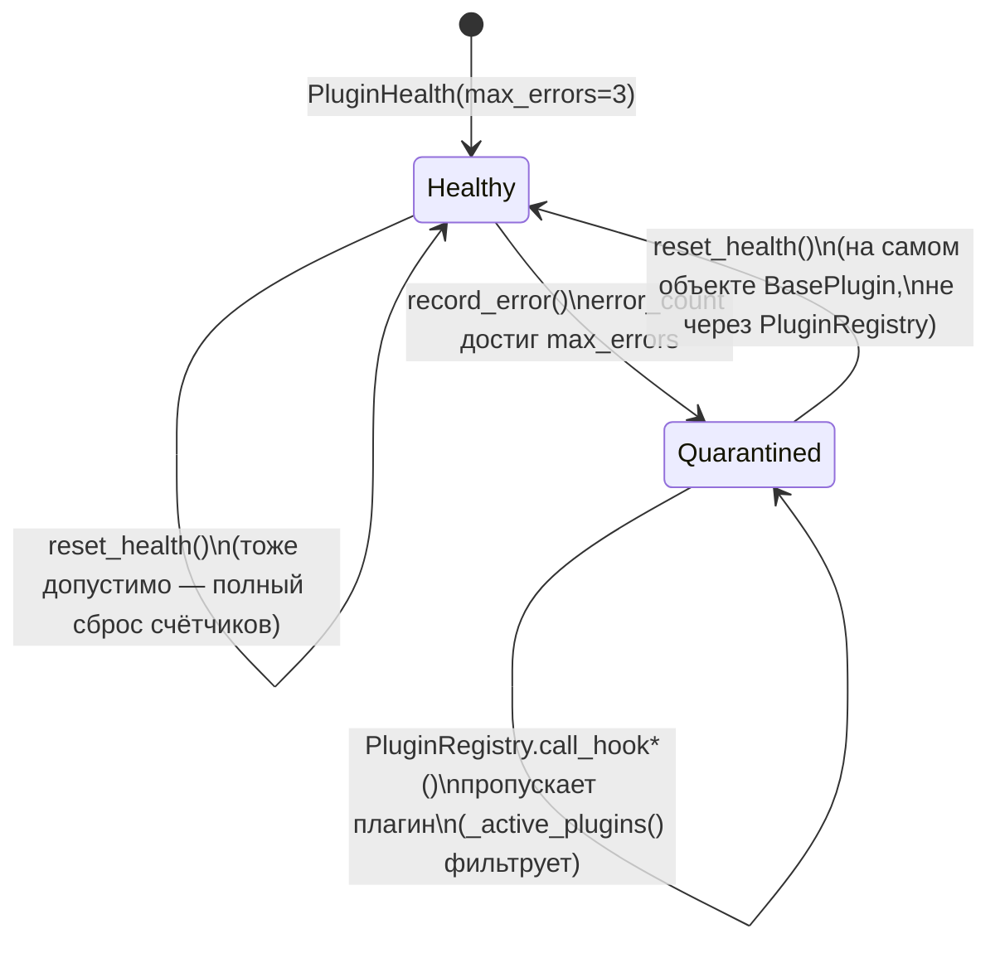
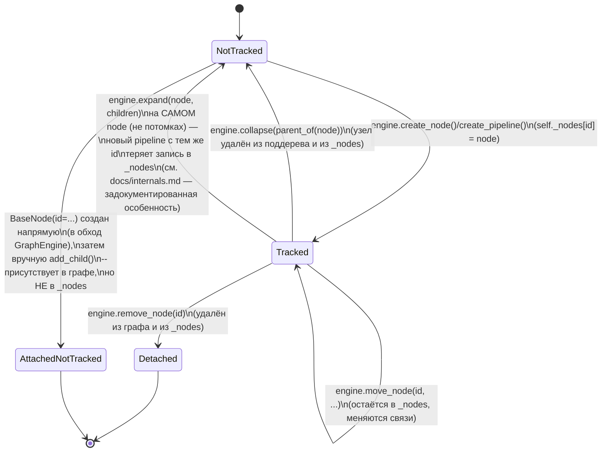

# State Diagram

> Важная оговорка, прежде чем читать дальше: `fsm_core` **не предоставляет
> общего примитива «конечный автомат»** — нет базового класса состояния,
> нет декларативных переходов, нет guard-условий, которые библиотека бы
> проверяла сама. `node_changed`/`notify_changed` переносят
> `old_state`/`new_state` как непрозрачные словари, которые целиком
> формирует вызывающий код. Единственные *настоящие*, управляемые самой
> библиотекой конечные автоматы — это внутренние жизненные циклы плагина
> (`PluginHealth`) и узла в реестре `GraphEngine._nodes`. Диаграммы ниже
> описывают именно их, а не какую-то придуманную доменную FSM.

## Здоровье плагина (`PluginHealth`)

**Важные нюансы, не всегда очевидные из названия состояний:**

- Переход `Healthy -> Quarantined` необратим *автоматически* — обратно в
  `Healthy` можно попасть только явным вызовом `plugin.reset_health()`;
  успешные вызовы хуков сами по себе из карантина не выводят (в
  `Quarantined` плагин вообще не получает вызовов хуков — `record_success`
  для него не произойдёт, пока он не выведен из карантина руками).
- `error_count` — счётчик **не «подряд», а накопительный за всё время**.
  Промежуточные `record_success()` не уменьшают и не обнуляют
  `error_count` — поэтому на диаграмме нет перехода «успех после ошибок
  снижает счётчик».
- `PluginHealth` не знает про конкретный хук, на котором произошла
  ошибка — карантин применяется ко **всему плагину**, не к отдельному
  хуку (см. `docs/plugins.md`).

## Жизненный цикл плагина в `PluginRegistry`

```mermaid
stateDiagram-v2
    [*] --> Unregistered

    Unregistered --> Registered: registry.register(plugin)\n(если имя ещё не занято)
    Unregistered --> Unregistered: registry.register(plugin)\n(имя уже занято -> no-op с warning)

    Registered --> Ready: registry.ready()\n(вызывается on_ready() у ВСЕХ\nзарегистрированных плагинов,\nвключая уже quarantined/disabled)

    state Registered {
        [*] --> Active
        Active --> Quarantined: 3-и подряд ошибки\nв любом вызванном хуке\n(см. диаграмму PluginHealth)
        Quarantined --> Active: reset_health()
        Active --> Disabled: enabled становится False\n(переопределением property\nв самом плагине)
        Disabled --> Active: enabled снова True
    }

    Registered --> [*]: (нет пути) —\nPluginRegistry не реализует unregister();\non_unregister() объявлен, но вызвать нечем
```

Состояние `Ready` показано отдельным переходом, но фактически не образует
отдельную «ветку» с собственным поведением после себя — `_is_ready`
устанавливается и нигде дальше не читается кодом `PluginRegistry` (не
блокирует вызов хуков до `ready()`, не влияет на `_active_plugins()`).
Единственный наблюдаемый эффект перехода в `Ready` — однократный вызов
`on_ready()`.

## Присутствие узла в реестре `GraphEngine._nodes`

Этот последний автомат — не часть публично объявленного контракта
библиотеки, а наблюдение, полученное чтением `engine.py`: он показывает,
что «узел присутствует в `self._nodes`» и «узел присутствует в графе,
достижимом обходом от корня» — это **два разных, не всегда совпадающих**
понятия существования узла. `get_node()` отвечает на первый вопрос,
`find_node()`/`get_flat_list()` — на второй. Несовпадение этих двух
понятий — не баг сам по себе (`AttachedNotTracked` — ожидаемое следствие
создания `BaseNode` напрямую, в обход `create_node`), кроме одного случая
— перехода `Tracked -> NotTracked` через `expand()`, который является
задокументированной особенностью поведения, а не намеренным дизайном (см.
`docs/internals.md#expandnode-children` и `docs/faq.md`).
