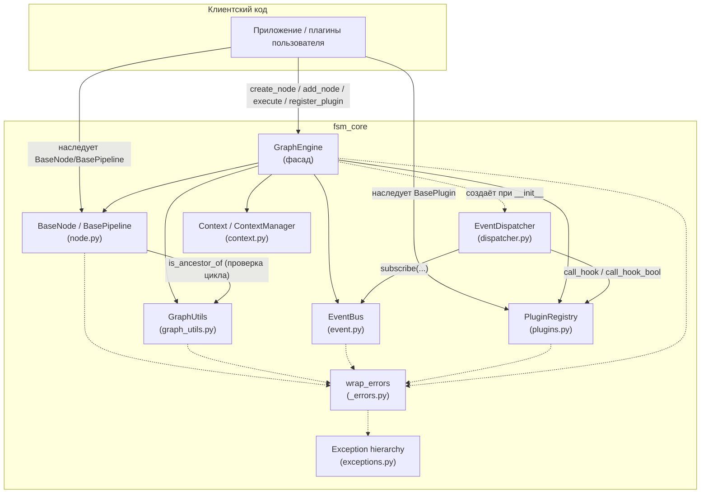
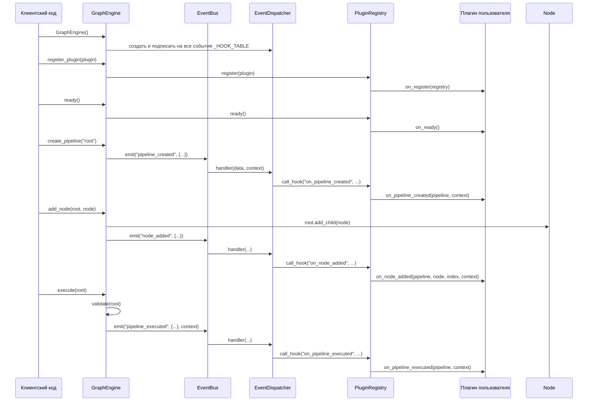

# Architecture

## Обзор

`fsm_core` состоит из шести модулей, каждый из которых отвечает ровно за
одну заботу, и одного фасада (`GraphEngine`), который их связывает:

| Модуль | Заботa |
|---|---|
| `node.py` | Данные графа: `BaseNode`, `BasePipeline` |
| `graph_utils.py` | Чистые алгоритмы над графом, без собственного состояния |
| `event.py` | Публикация событий: приоритеты, история, sync/async |
| `plugins.py` | Жизненный цикл и health-состояние плагинов |
| `dispatcher.py` | Мост между событиями и хуками плагинов |
| `context.py` | Сквозной контекст вызова |
| `engine.py` | Фасад, владеющий всем вышеперечисленным |
| `_errors.py` | Общий декоратор оборачивания исключений (внутренний) |
| `exceptions.py` | Иерархия исключений пакета |

## Зачем разделены именно так

Разделение проведено по оси **«кто о чём обязан знать»**, а не по оси
«файл на класс»:

- **`graph_utils.py` не знает про `EventBus`, `PluginRegistry` или
  `Context`.** Это чистые статические функции над объектом с полями
  `id/children/parents` — настолько чистые, что `test_graph_utils.py`
  тестирует их на классе-заглушке, вообще не подключая pydantic. Такое
  разделение позволяет тестировать и переиспользовать алгоритмы обхода
  независимо от того, как именно устроены узлы графа в остальном коде.
- **`plugins.py` не импортирует `node.py`/`context.py` напрямую** — только
  под `TYPE_CHECKING` (только для аннотаций типов, не во время выполнения).
  Это разрывает потенциальный цикл импортов `engine → plugins → node →
  graph_utils → engine` и одновременно фиксирует архитектурное решение:
  плагин физически не может импортировать и напрямую использовать
  внутренности `GraphEngine`, только то, что ему передают через параметры
  хуков.
- **`dispatcher.py` — единственное место, которое знает и про `EventBus`,
  и про `PluginRegistry`, и про то, какие ключи `event.data` соответствуют
  каким аргументам какого хука.** Это намеренная точка связывания: раньше
  (по комментариям в коде) это знание было размазано по двенадцати похожим
  методам, из-за чего рассинхронизация ключей публикации/чтения (см.
  `CHANGELOG.md`) оставалась незамеченной. Сведение к одной таблице
  (`_HOOK_TABLE`) плюс один метод `_dispatch` делает такое рассогласование
  видимым при чтении одного файла, а не двенадцати.
- **`engine.py` — единственный модуль, который знает про всё сразу.**
  Это осознанная асимметрия: `GraphEngine` — это фасад (паттерн Facade),
  его роль — дать пользователю библиотеки один объект вместо пяти, а не
  распределить знание равномерно.

## Диаграмма компонентов (C4, Mermaid)



## Зависимости между модулями (кто кого импортирует)

```
exceptions.py   <- ни от чего внутри пакета не зависит
_errors.py      <- ни от чего внутри пакета не зависит (кроме logging)
context.py      <- ни от чего внутри пакета не зависит
graph_utils.py  <- exceptions, _errors  (node — только TYPE_CHECKING)
node.py         <- exceptions, _errors, graph_utils
event.py        <- exceptions, _errors, context
plugins.py      <- exceptions, _errors  (context, node — только TYPE_CHECKING)
dispatcher.py   <- context, event, plugins
engine.py       <- exceptions, _errors, context, dispatcher, event,
                    graph_utils, node, plugins
```

Граф зависимостей — ацикличен (что для DAG-движка отчасти забавно, но
именно поэтому пакет вообще импортируется без ошибок `ImportError:
circular import`). `engine.py` — единственный лист, зависящий от всех
остальных; `exceptions.py`, `_errors.py`, `context.py` — единственные
«корни», от которых никто из перечисленных выше не зависит внутри пакета.

## Жизненный цикл выполнения (высокий уровень)



Обратите внимание: на каждом шаге `App -> Engine -> Bus -> Dispatcher ->
Registry -> Plugin` — это единообразный путь распространения *любого*
изменения графа до пользовательского кода. `GraphEngine` не вызывает хуки
плагинов напрямую — он только публикует события; сам факт, что события
доходят до плагинов, — заслуга того, что `EventDispatcher` заранее
подписался на все имена событий из `_HOOK_TABLE` в момент создания
`GraphEngine.__init__`.

## Что считать «границей» библиотеки

`GraphEngine`, `BaseNode`/`BasePipeline`, `BasePlugin`, `EventBus`,
`Context` — это то, с чем предполагается работать напрямую. `GraphUtils`
тоже публичный (экспортируется из `__init__.py`) и может использоваться
отдельно от `GraphEngine`, если нужны только алгоритмы обхода над
самодельной структурой узлов (см. тесты `test_graph_utils.py`, где
`GraphUtils` работает даже без pydantic).

`EventDispatcher`, `_Validate`-классы внутри модулей, `PluginHealth`
(создаётся `BasePlugin` автоматически) и `_errors.wrap_errors` — не
экспортируются из `fsm_core/__init__.py` и не задуманы как часть
публичного API, даже если технически импортируемы напрямую из подмодулей.

Подробнее об инвариантах графа — [graph_model.md](graph_model.md), о
последовательности событий на каждой операции —
[execution_flow.md](execution_flow.md).
