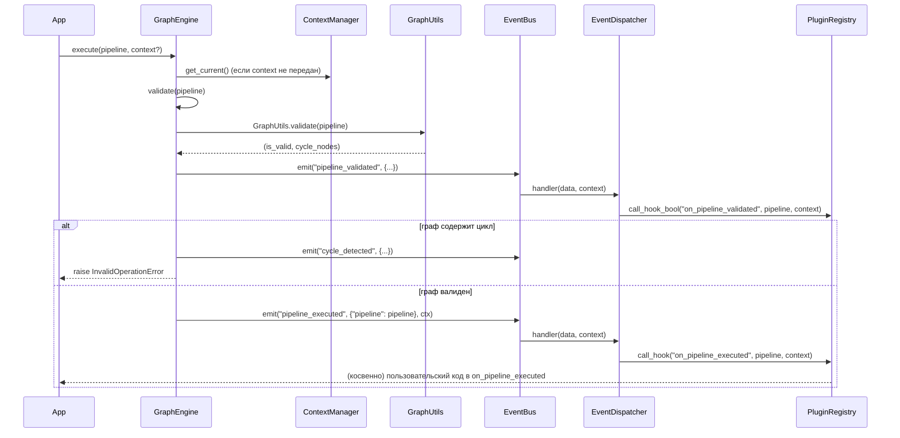

# Execution Flow

## Ключевая идея: `execute` — это уведомление, а не выполнение

`GraphEngine.execute(pipeline, context=None)` не запускает никакой
пользовательской логики, ассоциированной с узлами `pipeline`. Реализация
целиком:

```python
def execute(self, pipeline, context=None):
    ctx = context or self._context_manager.get_current()
    is_valid, _ = self.validate(pipeline)
    if not is_valid:
        raise InvalidOperationError("Pipeline has cycles, cannot execute")
    self._event_bus.emit("pipeline_executed", data={"pipeline": pipeline}, context=ctx)
    return self
```

Она (1) валидирует пайплайн на циклы и (2) публикует одно событие. Любая
реальная работа — то, что происходит в `on_pipeline_executed` у
зарегистрированных плагинов, либо в обработчиках, подписанных напрямую на
`EventBus`. Библиотека не знает и не спрашивает, что означает «выполнить»
узел `fetch` — это решает исключительно потребитель.

## Последовательность вызовов `execute`



Обратите внимание на `on_pipeline_validated` — единственный хук, вызываемый
через `call_hook_bool`, а не `call_hook`. Это значит, что плагин может
**вернуть `False` и повлиять на результат `validate()`**: если хотя бы один
активный плагин вернёт `False` из `on_pipeline_validated`, событие
`cycle_detected` эмитится... нет — не совсем: `call_hook_bool` влияет на
итог, который возвращает `_registry.call_hook_bool`, но `GraphEngine.validate`
**не читает этот результат** — он использует только `GraphUtils.validate`
(структурную проверку циклов) для решения, поднимать исключение или нет.
Другими словами: `on_pipeline_validated` может вернуть `False`, событие
дойдёт до плагина, но это не изменит, продолжит ли `execute()` работу —
это единственная официальная точка «вето», которая в текущей версии
`engine.py` не используется как вето. Зафиксировано здесь явно, чтобы не
рассчитывать на это как на работающий механизм отмены выполнения.

## `mutate` — тот же принцип, для «граф изменился, но не выполнился»

```python
def mutate(self, pipeline, context=None):
    ...
    self._event_bus.emit("pipeline_mutated", data={"pipeline": pipeline}, context=ctx)
    self._event_bus.emit("graph_changed", data={"pipeline": pipeline}, context=ctx)
    return self
```

`mutate` эмитит **два** события: `pipeline_mutated` (специфичное) и
`graph_changed` (общее). `graph_changed` также эмитится всеми четырьмя
структурными операциями (`simplify`, `expand`, `collapse`, `replace_node`)
— это единая точка, на которую можно подписаться, если плагину не важно,
*какая именно* структурная операция произошла, важен сам факт изменения.

`mutate()` не вызывается автоматически ни при `add_node`, ни при
`remove_node`, ни при `move_node` — у этих операций свои собственные,
более специфичные события (`node_added`, `node_removed`, `node_moved`).
`mutate()`/`graph_changed` нужно вызывать/использовать явно, когда
семантика изменения не укладывается в конкретное точечное событие.

## `notify_changed` — для изменений состояния узла

```python
def notify_changed(self, node, old_state, new_state, context=None):
    ...
    self._event_bus.emit("node_changed", data={"node": node, "old_state": old_state, "new_state": new_state}, ...)
```

`old_state`/`new_state` — это **произвольные словари, которые передаёт
вызывающий код**. `GraphEngine` не вычисляет их сам, не сравнивает старое
и новое состояние узла, не хранит историю состояний. Это транспорт для
уведомления, а не механизм отслеживания изменений. Если приложению нужно
реальное diff-отслеживание состояния — эту логику нужно реализовать
отдельно и просто передать готовые `old_state`/`new_state` сюда.

## Структурные перестройки: единая точка правды

`simplify`, `expand`, `collapse`, `replace_node` находятся все вместе в
`engine.py` и переиспользуют реестр `self._nodes` для поддержания
согласованности «какие узлы существуют» после перестройки. Подробное
поведение каждой — в [internals.md](internals.md#структурные-перестройки).
Общее для всех четырёх:

- Каждая — итеративна (явный стек, не рекурсия) там, где нужен обход
  поддерева (`simplify`, `collapse`).
- Каждая эмитит `graph_changed` по завершении — не пооперационно на каждый
  затронутый узел, а один раз на всю перестройку.
- Каждая поддерживает `self._nodes` в согласованности с реальной
  структурой графа: удалённые из графа узлы удаляются и из `_nodes`.

## Куда идти дальше

- [events.md](events.md) — полный список событий и их данные.
- [plugins.md](plugins.md) — что происходит внутри `call_hook`/
  `call_hook_bool`/`call_hook_first`.
- [internals.md](internals.md) — пошаговое поведение каждой структурной
  операции.
